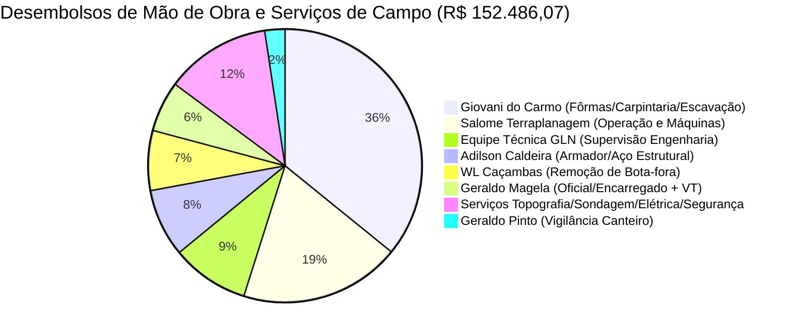

# Auditoria de Mão de Obra e Governança da Trava do Custo Global

**Projeto:** Residência Bruno e Kelly - Rua João de Almeida, Lote 25C, Bairro Estoril, Belo Horizonte/MG  
**Data da Auditoria:** Setembro/2026  
**Status da Obra:** Superestrutura - Laje do Pavimento Térreo (Avanço Físico: 7,0%)  
**Base Documental Auditada:**
- Fechamentos Financeiros Oficiais GLN: Medições 04, 05, 06, 07 preliminar e 10 (Setembro/Outubro 2026)
- Orçamento Analítico Parametrizado V2 (`Orçamento – Bruno e Kely - Estoril – Completo V2.xlsx`)
- Contrato de Construção por Administração (`CONTRATO DE EXECUÇÃO DE CONSTRUÇÃO NO REGIME DE ADMINISTRAÇÃO - 11-11-2025 - REV00`)
- Relatório Mensal Executivo GLN - Agosto/2026 e Planilha de Controle de Desvios
- Indicadores Locais da Construção Civil em BH/MG: CUB-MG (Sinduscon-MG - R1-A), SINAPI-MG e SUDECAP

---

## 1. Premissa Comercial e Governança da Trava do Custo Global

No modelo de contratação por **administração de obras**, foi acordada a incidência da taxa de administração de **12,0% sobre o custo integral da obra** (materiais, insumos, locações, subcontratos, equipe técnica de campo e operários). 

Nesse contexto, **a única salvaguarda financeira efetiva do proprietário é a TRAVA DO CUSTO GLOBAL (R$ 2.422.178,51)**.

### Painel de Bordo da Trava Global (Posição Medição 06 - Agosto/2026)

| Indicador de Custo | Valor Orçado (R$) | Realizado Acumulado (R$) | % Consumido | Saldo Restante (R$) |
| :--- | :---: | :---: | :---: | :---: |
| **Custo Direto de Obra** | R$ 2.162.659,38 | R$ 295.383,38 | 13,66% | R$ 1.867.276,00 |
| **Taxa de Adm GLN (12%)** | R$ 259.519,13 | R$ 35.378,41 | 13,63% | R$ 224.140,72 |
| **TRAVA DO CUSTO GLOBAL** | **R$ 2.422.178,51** | **R$ 330.761,79** | **13,66%** | **R$ 2.091.416,72** |
| **Avanço Físico Medido** | **100,0%** | **7,0%** | *(Aderente à Linha de Base)* | **93,0% a Realizar** |

> [!NOTE]
> **Por que o avanço financeiro acumulado (13,66%) supera o avanço físico (7,0%)?**  
> Não se trata de descontrole, mas da concentração natural de **custos preliminares e setup** (terraplanagem pesada Salome R$ 29k, sondagens SPT, topografia, taxas de alvará e água provisória) somada à **antecipação de compras de insumos estruturais em grande lote**:
> - Madeiras e madeirite para 100% das fôrmas (Madeireira Estrela R$ 24,4k quitados);
> - Aço cortado e dobrado (Santa Clara);
> - Painéis treliçados maciços da laje Incobráz (NF 20283 / R$ 26.800,00) já estocados no canteiro.
> Esse valor investido converte avanço físico na concretagem geral do térreo (16/09/2026).

---

## 2. Radiografia dos Desembolsos de Mão de Obra Realizados

Até a Medição 06, foram pagos em mão de obra e serviços humanos de campo:

### 2.1. Detalhamento Nominal da Mão de Obra Direta (R$ 94.766,27)

1. **Giovani Vieira do Carmo (Carpintaria, Fôrmas e Escavações): R$ 54.668,12 (57,69%)**
   - *Fôrmas de Vigas, Pilares e Blocos (Subsolo e Térreo):* **R$ 60,00 / m²**
   - *Escavação Manual em Solo Duro / Rocha (Sapatas e Tubulão P-PISC2):* **R$ 180,00 / m³**
   - *Enchimento Manual de Caçambas:* **R$ 180,00 / m³**
   - *Barracão e Portão:* R$ 2.500,00 (vb) | *Tabeira/Gabarito:* R$ 3.000,00 (vb)
   - *Concretagem Convencional:* R$ 1.800,00 (vb)
   - *Diárias de Ajudantes de Apoio:* R$ 300,00/dia (para 2 ajudantes = R$ 150/ajudante/dia)
2. **Equipe Técnica GLN (Engenharia de Campo): R$ 14.000,00 (14,77%)**
   - Duas parcelas de **R$ 7.000,00/mês** (Medições 05 e 06), conforme previsto no Contrato (Cláusula 4.1) e Orçamento (Item 03.02.01).
3. **Adilson Gomes Caldeira (Armação de Aço): R$ 12.243,15 (12,92%)**
   - *Corte, dobra e amarração de ferragens:* **R$ 3,50 / kg** de aço armado na estrutura.
4. **Geraldo Magela Fagundes (Oficial / Encarregado Residente): R$ 9.148,00 (9,65%)**
   - *Diárias de Campo:* **R$ 250,00 / dia** (27 diárias = R$ 7.418,80).
   - *Vale-Transporte:* R$ 30,40 a R$ 40,40 / dia (R$ 1.729,20).
5. **Geraldo Antônio Pinto (Vigilância do Canteiro): R$ 3.640,00 (3,84%)**
   - *Plantão Noturno (12h):* **R$ 200,00 / noite** (15 noites = R$ 3.000,00).
   - *Plantão Diurno (12h):* **R$ 160,00 / dia** (4 dias = R$ 640,00).
6. **Instalações Provisórias e Apoio:**
   - *Ronaldo Ribeiro (Elétrica provisória):* R$ 400,00
   - *Cléber Oliveira (Cavalete COPASA):* R$ 300,00
   - *Apoio Inicial de Máquinas:* R$ 367,00

---

## 3. Diligência Comparada com o Mercado da Construção Civil (Belo Horizonte / MG)

| Especialidade / Serviço | Unid. | Valor na Obra Estoril | Referencial BH/MG (CUB/SINAPI) | Avaliação Técnica |
| :--- | :---: | :---: | :---: | :--- |
| **Armador de Ferro** | kg | **R$ 3,50** | R$ 3,00 a R$ 4,20 | **Altamente Competitivo.** Alinhado com a média para estruturas nobres. |
| **Carpintaria de Fôrmas** | m² | **R$ 60,00** | R$ 50,00 a R$ 75,00 | **Muito Saudável.** Qualidade superficial comprovada (pilares desformados sem bicheiras). |
| **Oficial / Encarregado** | dia | **R$ 250,00** (+ VT) | R$ 220,00 a R$ 300,00 | **Na Média de Mercado.** Equivale a ~R$ 5.500/mês para coordenação física direta. |
| **Servente / Ajudante** | dia | **R$ 130,00** | R$ 110,00 a R$ 150,00 | **Alinhado.** Prática padrão de diária em BH. |
| **Escavação Manual de Sapatas** | m³ | **R$ 180,00** | Solo 1ª cat: R$ 65 a 90 Solo 2ª cat: R$ 140 a 220 | **Ponto de Atenção.** Aceitável exclusivamente pela presença de rocha a <2m no Estoril. |
| **Vigilância Física Contínua** | dia | **R$ 360,00** (24h) | R$ 160 a 220 noite / R$ 130 a 170 dia | **Unitário Razoável, Custo Global Crítico.** Gera R$ 10.800/mês. Exige corte imediato após a laje. |

---

## 4. O Controle Oficial de Desvios da GLN (Agosto/2026)

Na auditoria do Relatório Mensal Oficial de Agosto/2026 e na planilha interna `Controle de desvios`, a engenharia da GLN reconheceu formalmente um desvio acumulado de **R$ 17.966,10 em itens não orçados** (Custo Previsto: R$ 312.795,69 vs. Realizado: R$ 330.761,79):

1. **Padrão de energia CEMIG furtado 3 vezes** (compra de cabos, relógio e caixas extras);
2. **8 estacas de fundação atingiram solo impenetrável a < 2,0m**, forçando revisão do projeto estrutural para sapatas e tubulão P-PISC2 com escavação em rocha;
3. **Locação emergencial de gerador** devido à falta de energia decorrente dos furtos;
4. **Aditivo de corte de terra** para trânsito da perfuratriz mecanizada no talude;
5. **Contratação de vigia noturno e diurno** (R$ 360/dia).

---

## 5. Matriz de Ganhos vs. Ameaças à Trava do Custo Global

### A. Onde a Mão de Obra Gerou Margem de Proteção (+ R$ 26.500,00):
- No orçamento analítico, as fôrmas maciças foram estimadas a **R$ 130,00/m²** (composição fechada = R$ 109.551,00).
- A separação de compras pela GLN (madeirite direto na Madeireira Estrela por ~R$ 32.500 e fôrma a R$ 60,00/m² com Giovani) projeta um custo final de ~R$ 83.000,00.
- **Resultado:** **Economia de ~R$ 26.500,00** retida no saldo da trava global.

### B. Ameaças Imediatas à Trava que Devem ser Neutralizadas:
1. **Vigilância Humana (R$ 10.800,00 / mês):**
   - Se mantida por mais 3 meses, queimará **R$ 32.400,00**, anulando toda a economia da carpintaria de fôrmas.
   - *Diretriz:* Substituir por alarme eletrônico monitorado 24h e câmeras 4G (~R$ 1.000/mês) logo após a concretagem da laje do térreo em 16/09.
2. **Teto Inegociável para Elétrica e Hidráulica (Gargalos ATV-0011 e ATV-0012):**
   - *Hidráulica (Item 07.02.13):* **Teto de R$ 42.000,00**
   - *Elétrica (Item 07.03.08):* **Teto de R$ 38.000,00**
   - A GLN deve fechar com Ronaldo Ribeiro e Cléber Oliveira rigorosamente dentro dessas balizas, atrelando os desembolsos a 4 marcos físicos de avanço.
3. **Assentamento do Porcelanato Nobre 1,20x1,20m e Pedra Piscina TAJ:**
   - O piso de grande formato requer assentamento com dupla colagem AC-III e niveladores (R$ 90 a R$ 130/m² vs R$ 70/m² orçado), gerando um GAP potencial de ~R$ 25.000,00 na fase de acabamentos. Manter as economias de estrutura intactas é mandatório para absorver esse upgrade.

---

## 6. Parecer Conclusivo da Auditoria

1. **Aderência Global:** O avanço financeiro de 13,66% (R$ 330.761,79) é compatível com o estágio de mobilização e compra de insumos pesados. O saldo de **R$ 2.091.416,72** é suficiente para os 93% restantes da obra, desde que as ameaças de custos indiretos sejam contidas.
2. **Qualidade Técnica:** As taxas de fôrma (R$ 60/m²) e aço (R$ 3,50/kg) resultaram em excelente qualidade estrutural comprovada em campo (pilares sem bicheiras).
3. **Plano de Ação Imediato:**
   - Fechar Elétrica e Hidráulica nos tetos de R$ 38k e R$ 42k;
   - Desmobilizar a vigilância humana de R$ 360/dia após a laje do térreo;
   - Blindar a trava global de R$ 2.422.178,51 em todas as medições subsequentes.
