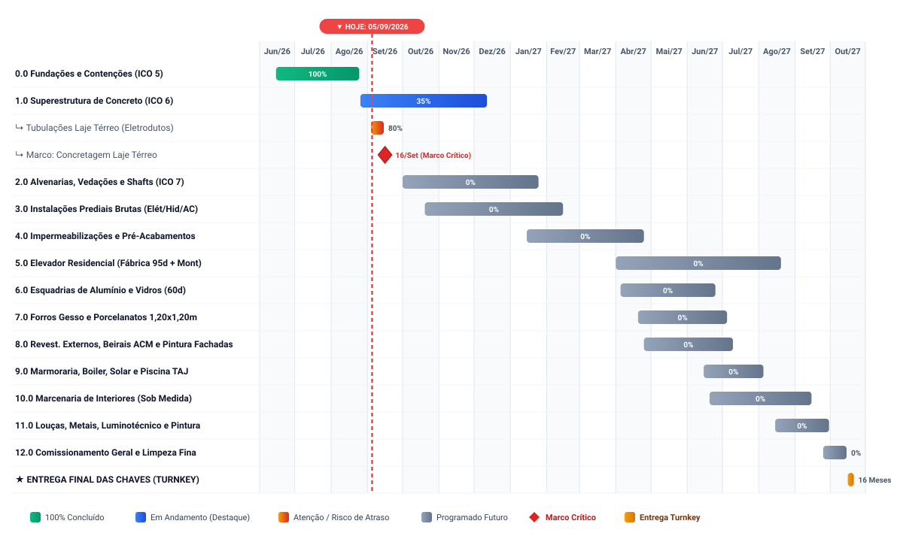

# Cronograma Macro de Obra - Casa Estoril

**Data-Base da Última Atualização:** 05/09/2026  
**Início Físico Efetivo:** 15/06/2026  
**Término Previsto (Turnkey):** 20/10/2027  
**Duração Total da Obra Física:** 492 dias corridos (~16 meses)  

---

## 1. Painel Executivo de Avanço e Desvios de Prazo

| Indicador Executivo | Previsto na Linha de Base | Realizado em Campo | Desvio / Status de Prazo |
| :--- | :---: | :---: | :--- |
| **Avanço Físico Global** | **7,0%** | **7,0%** | **0 dias (Aderente à Linha de Base)** |
| **0.0 Serviços Preliminares e Fundações** | 100% | 100% | **Concluído no Prazo** (Finalizado em 25/08/2026) |
| **1.0 Superestrutura de Concreto Armado** | 35% | 35% | **EM ANDAMENTO / EM DESTAQUE** (Fôrmas e aço do Térreo 100%) |
| ↳ *Ponto Crítico Imediato (Gargalo)* | 100% até 14/09 | 80% em 05/09 | **Atenção / Risco de Atraso** (Concluir tubulações de laje antes do concreto) |
| ↳ *Marco Mandatório da Estrutura* | 16/09/2026 | Programado | **Sem Atraso** (Concretagem Laje do Térreo confirmada para 16/09) |
| **2.0 a 12.0 Etapas Seguintes** | 0% | 0% | **Dentro da Janela Prevista** (Início das vedações em Out/2026) |

---

## 2. Timeline Horizontal (Gantt)

---

## 3. Tabela Detalhada de Atividades e Prazos

| ID | Atividade / Pacote de Trabalho | Início | Término | Duração | Avanço (%) | Status / Desvio de Prazo |
| :---: | :--- | :---: | :---: | :---: | :---: | :--- |
| **0.0** | **SERVIÇOS PRELIMINARES E FUNDAÇÕES** | **15/06/2026** | **25/08/2026** | **71 dias** | **100%** | **Concluído no Prazo** |
| 0.1 | Despesas Legais, Licenças e Setup do Canteiro | 15/06/2026 | 30/06/2026 | 15 dias | 100% | Concluído |
| 0.2 | Terraplenagem Pesada, Cortes de Talude e Platô | 18/06/2026 | 15/07/2026 | 27 dias | 100% | Concluído |
| 0.3 | Topografia, Gabarito e Locação de Estacas/Pilares | 25/06/2026 | 05/07/2026 | 10 dias | 100% | Concluído |
| 0.4 | Perfuração de Estacas e Escavação de Sapatas em Rocha | 06/07/2026 | 31/07/2026 | 25 dias | 100% | Concluído |
| 0.5 | Cintamento do Subsolo (Fôrma, Aço e Concreto das Baldrames) | 01/08/2026 | 20/08/2026 | 19 dias | 100% | Concluído |
| 0.6 | Pilares de Arranque do Subsolo (Fôrma, Aço, Concreto e Desforma) | 12/08/2026 | 25/08/2026 | 13 dias | 100% | Concluído |
| **1.0** | **SUPERESTRUTURA DE CONCRETO ARMADO** | **26/08/2026** | **12/12/2026** | **108 dias** | **35%** | **EM ANDAMENTO (EM DESTAQUE)** |
| 1.1 | Cimbramento e Caixarias das Vigas do Térreo (1º Pavimento) | 26/08/2026 | 08/09/2026 | 13 dias | 100% | Concluído no Prazo |
| 1.2 | Montagem dos Painéis Treliçados Incobráz e Armadura da Laje Térreo | 01/09/2026 | 12/09/2026 | 11 dias | 100% | Concluído no Prazo |
| 1.3 | Instalações Embutidas na Laje Térreo (Sleeves, Tubos Passantes e Dutos) | 04/09/2026 | 15/09/2026 | 11 dias | 80% | **Em Andamento (Atenção p/ Concretagem)** |
| 1.4 | Concretagem das Vigas e Laje do Térreo (1º Pavimento) | 16/09/2026 | 16/09/2026 | 1 dia | 0% | **Programado para 16/09 (Marco Crítico)** |
| 1.5 | Cura Úmida e Desforma Lateral das Vigas do Térreo | 17/09/2026 | 24/09/2026 | 7 dias | 0% | Não Iniciado |
| 1.6 | Pilares do Térreo para o 2º Pavimento (Fôrma, Armação e Concreto) | 21/09/2026 | 02/10/2026 | 11 dias | 0% | Não Iniciado |
| 1.7 | Vigas e Laje do 2º Pavimento (Cimbramento, Painéis e Armadura) | 03/10/2026 | 27/10/2026 | 24 dias | 0% | Não Iniciado |
| 1.8 | Concretagem da Laje e Vigas do 2º Pavimento | 28/10/2026 | 28/10/2026 | 1 dia | 0% | Não Iniciado |
| 1.9 | Pilares do 2º Pavimento para Cobertura (Fôrma, Armação e Concreto) | 29/10/2026 | 09/11/2026 | 11 dias | 0% | Não Iniciado |
| 1.10 | Vigas e Laje de Cobertura / Barrilete (Cimbramento, Painéis e Armadura) | 10/11/2026 | 01/12/2026 | 21 dias | 0% | Não Iniciado |
| 1.11 | Concretagem da Laje de Cobertura e Vigas Técnicas do Barrilete | 02/12/2026 | 02/12/2026 | 1 dia | 0% | Não Iniciado |
| 1.12 | Desformas Finais de Lajes e Limpeza Estrutural | 03/12/2026 | 12/12/2026 | 9 dias | 0% | Não Iniciado |
| **2.0** | **ALVENARIAS, VEDAÇÕES E SHAFTS** | **01/10/2026** | **25/01/2027** | **116 dias** | **0%** | **Não Iniciado (No Prazo)** |
| 2.1 | Alvenarias do Subsolo e Muros de Contenção/Arrimo da Piscina | 01/10/2026 | 10/11/2026 | 40 dias | 0% | Não Iniciado |
| 2.2 | Alvenaria do Pavimento Térreo e Shafts Técnicos Centrais | 01/11/2026 | 30/11/2026 | 29 dias | 0% | Não Iniciado |
| 2.3 | Alvenaria do 2º Pavimento e Shaft do Elevador | 20/11/2026 | 20/12/2026 | 30 dias | 0% | Não Iniciado |
| 2.4 | Alvenarias de Platibandas, Caixa d'Água e Barrilete | 05/12/2026 | 28/12/2026 | 23 dias | 0% | Não Iniciado |
| 2.5 | Encunhamentos Flexíveis Gerais (Acomodação de Deformação Lenta) | 26/12/2026 | 25/01/2027 | 30 dias | 0% | Não Iniciado |
| **3.0** | **INSTALAÇÕES PREDIAIS - INFRAESTRUTURA BRUTA** | **20/10/2026** | **15/02/2027** | **118 dias** | **0%** | **Não Iniciado (No Prazo)** |
| 3.1 | Tubulações Elétricas, Caixas 4x2 e Eletrodutos em Alvenarias | 20/10/2026 | 10/01/2027 | 82 dias | 0% | Não Iniciado |
| 3.2 | Tubulações Hidráulicas (Água Fria/Quente PPR/CPVC) e Esgoto nos Shafts | 05/11/2026 | 15/01/2027 | 71 dias | 0% | Não Iniciado |
| 3.3 | Infraestrutura de Climatização (Tubulações de Cobre e Drenos de A/C) | 15/11/2026 | 15/01/2027 | 61 dias | 0% | Não Iniciado |
| 3.4 | Prumadas Verticais, Barrilete, QDCs e Malha de Aterramento/SPDA | 15/12/2026 | 30/01/2027 | 46 dias | 0% | Não Iniciado |
| 3.5 | Testes de Estanqueidade e Pressurização Hidrossanitária (Bloqueio Mandatório) | 01/02/2027 | 15/02/2027 | 14 dias | 0% | Não Iniciado |
| **4.0** | **IMPERMEABILIZAÇÕES PESADAS E PRÉ-ACABAMENTOS** | **15/01/2027** | **25/04/2027** | **100 dias** | **0%** | **Não Iniciado (No Prazo)** |
| 4.1 | Impermeabilização da Cobertura e Calhas (Mantas Asfálticas e Teste 72h) | 15/01/2027 | 20/02/2027 | 36 dias | 0% | Não Iniciado |
| 4.2 | Impermeabilização da Piscina, Prainha e Reservatórios de Água | 01/02/2027 | 05/03/2027 | 32 dias | 0% | Não Iniciado |
| 4.3 | Chapisco e Reboco Interno de Paredes (Subsolo, Térreo e 2º Pavimento) | 15/02/2027 | 25/03/2027 | 38 dias | 0% | Não Iniciado |
| 4.4 | Chapisco e Reboco de Fachadas Externas | 25/02/2027 | 05/04/2027 | 39 dias | 0% | Não Iniciado |
| 4.5 | Chumbamento e Nivelamento de Contramarcos de Esquadrias | 01/03/2027 | 25/03/2027 | 24 dias | 0% | Não Iniciado |
| 4.6 | Execução dos Contrapisos Internos e Caimentos para Ralos | 25/03/2027 | 20/04/2027 | 26 dias | 0% | Não Iniciado |
| 4.7 | Período de Cura Normativa dos Contrapisos (28 dias p/ Grandes Formatos) | 21/04/2027 | 19/05/2027 | 28 dias | 0% | Não Iniciado |
| **5.0** | **ELEVADOR RESIDENCIAL (3 PARADAS)** | **01/02/2027** | **25/06/2027** | **144 dias** | **0%** | **Não Iniciado (Gatilho: Jan/27)** |
| 5.1 | Medição de Prumo do Shaft e Validação do Fosso de 1,00m do Subsolo | 01/02/2027 | 10/02/2027 | 9 dias | 0% | Não Iniciado |
| 5.2 | Fabricação Fabril do Elevador, Guias, Pistão/Máquina e Cabina (Lead Time) | 11/02/2027 | 25/05/2027 | 103 dias | 0% | Não Iniciado |
| 5.3 | Montagem Mecânica dos Trilhos, Cabina, Contrapeso e Portas | 26/05/2027 | 15/06/2027 | 20 dias | 0% | Não Iniciado |
| 5.4 | Ligação Elétrica ao QD1, Parametrização, Comissionamento e ART | 16/06/2027 | 25/06/2027 | 9 dias | 0% | Não Iniciado |
| **6.0** | **ESQUADRIAS DE ALUMÍNIO E VIDROS** | **05/04/2027** | **25/06/2027** | **81 dias** | **0%** | **Não Iniciado (No Prazo)** |
| 6.1 | Medição Fina em Obra dos Vãos Rebocados com Contramarcos | 05/04/2027 | 15/04/2027 | 10 dias | 0% | Não Iniciado |
| 6.2 | Fabricação Fabril dos Caixilhos de Alumínio e Vidros Laminados/Temperados | 16/04/2027 | 10/06/2027 | 55 dias | 0% | Não Iniciado |
| 6.3 | Instalação em Obra, Claraboia, Fixação e Vedação Hermética (Fechamento da Casa) | 11/06/2027 | 25/06/2027 | 14 dias | 0% | Não Iniciado |
| **7.0** | **FORROS DE GESSO, ENFIAÇÃO E PISOS NOBRES** | **20/04/2027** | **05/07/2027** | **76 dias** | **0%** | **Não Iniciado (No Prazo)** |
| 7.1 | Estruturação e Fechamento de Forros de Gesso Acartonado (Drywall) | 20/04/2027 | 25/05/2027 | 35 dias | 0% | Não Iniciado |
| 7.2 | Enfiação Elétrica Geral, Cabos Alimentadores e Cabeamento de Rede | 10/05/2027 | 10/06/2027 | 31 dias | 0% | Não Iniciado |
| 7.3 | Assentamento de Porcelanatos Grandes Formatos 1,20x1,20m nos Pisos | 20/05/2027 | 05/07/2027 | 46 dias | 0% | Não Iniciado |
| 7.4 | Revestimento da Piscina com Rocha Natural Serpentinito 20x20 TAJ | 20/05/2027 | 20/06/2027 | 31 dias | 0% | Não Iniciado |
| 7.5 | Revestimentos Cerâmicos de Paredes em Áreas Molhadas (Banhos/Cozinha) | 25/05/2027 | 30/06/2027 | 36 dias | 0% | Não Iniciado |
| **8.0** | **REVESTIMENTOS EXTERNOS, BEIRAIS EM ACM E PINTURA DE FACHADAS** | **25/04/2027** | **10/07/2027** | **76 dias** | **0%** | **Não Iniciado (No Prazo)** |
| 8.1 | Assentamento de Pedra Madeira Off-White / Moledo (Muros, Pórticos e Fachadas) | 25/04/2027 | 05/06/2027 | 42 dias | 0% | Não Iniciado |
| 8.2 | Assentamento de Plaquinhas de Tijolinho (Panos de Fachada e Gourmet) | 05/05/2027 | 05/06/2027 | 31 dias | 0% | Não Iniciado |
| 8.3 | Instalação de Forro dos Beirais em Painéis de ACM Amadeirado (Subestrutura de Alumínio) | 15/05/2027 | 15/06/2027 | 31 dias | 0% | Não Iniciado |
| 8.4 | Pintura Externa Emborrachada e Texturas (Coral Sol & Chuva ou Suvinil Proteção Total) | 05/06/2027 | 10/07/2027 | 35 dias | 0% | Não Iniciado |
| **9.0** | **MARMORARIA, EQUIPAMENTOS ESPECIAIS E ENERGIA** | **15/06/2027** | **05/08/2027** | **51 dias** | **0%** | **Não Iniciado (No Prazo)** |
| 9.1 | Marmoraria: Medição com Moldes, Corte e Instalação de Bancadas e Ilhas | 15/06/2027 | 20/07/2027 | 35 dias | 0% | Não Iniciado |
| 9.2 | Aquecimento Central: Instalação do Boiler 800L, Aquecedores a Gás e Bombas | 15/06/2027 | 10/07/2027 | 25 dias | 0% | Não Iniciado |
| 9.3 | Microgeração Fotovoltaica: Fixação de Módulos, Inversor e Homologação CEMIG | 20/06/2027 | 20/07/2027 | 30 dias | 0% | Não Iniciado |
| 9.4 | Equipamentos da Piscina: Filtro, Bombas, Iluminação LED e Trocador de Calor | 01/07/2027 | 25/07/2027 | 24 dias | 0% | Não Iniciado |
| 9.5 | Climatização: Instalação de Evaporadoras, Condensadoras, Vácuo e Carga de Gás | 10/07/2027 | 05/08/2027 | 26 dias | 0% | Não Iniciado |
| **10.0** | **MARCENARIA DE INTERIORES (SOB MEDIDA)** | **20/06/2027** | **15/09/2027** | **87 dias** | **0%** | **Não Iniciado (No Prazo)** |
| 10.1 | Medição Fina Milimétrica no Local (Após Piso, Forro e Bancadas Concluídos) | 20/06/2027 | 05/07/2027 | 15 dias | 0% | Não Iniciado |
| 10.2 | Fabricação em Fábrica de Móveis (Cortes CNC, Bordas e Ferragens) | 06/07/2027 | 20/08/2027 | 45 dias | 0% | Não Iniciado |
| 10.3 | Montagem em Obra: Cozinha, Closets Master, Banhos, Rouparia e Painéis | 21/08/2027 | 15/09/2027 | 25 dias | 0% | Não Iniciado |
| **11.0** | **ACABAMENTOS FINAIS, PINTURA INTERNA E LUMINOTÉCNICO** | **15/08/2027** | **30/09/2027** | **46 dias** | **0%** | **Não Iniciado (No Prazo)** |
| 11.1 | Instalação de Louças Sanitárias, Metais, Chuveiros e Acessórios | 15/08/2027 | 05/09/2027 | 21 dias | 0% | Não Iniciado |
| 11.2 | Montagem de Luminárias, Spots, Perfis de LED e Espelhos de Tomada/Interruptores | 25/08/2027 | 15/09/2027 | 21 dias | 0% | Não Iniciado |
| 11.3 | Pintura Final Interna de Tetos e Paredes (Demãos Finais e Correções Pós-Marcenaria) | 10/09/2027 | 30/09/2027 | 20 dias | 0% | Não Iniciado |
| 11.4 | Calafetações com Silicone, Rejuntes Epóxi e Vedações Finais de Esquadrias/Boxes | 15/09/2027 | 30/09/2027 | 15 dias | 0% | Não Iniciado |
| **12.0** | **COMISSIONAMENTO, LIMPEZA E ENTREGA TURNKEY** | **25/09/2027** | **20/10/2027** | **25 dias** | **0%** | **Não Iniciado (No Prazo)** |
| 12.1 | Limpeza Técnica Profissional Pós-Obra (Grossa e Fina) | 25/09/2027 | 07/10/2027 | 12 dias | 0% | Não Iniciado |
| 12.2 | Comissionamento Integrado dos Sistemas (Elevador, Solar, Piscina, Boiler e A/C) | 05/10/2027 | 15/10/2027 | 10 dias | 0% | Não Iniciado |
| 12.3 | Vistoria Técnica Final com os Proprietários e Entrega Oficial das Chaves | 16/10/2027 | 20/10/2027 | 4 dias | 0% | Não Iniciado |
| **MARCO** | **ENTREGA FINAL DAS CHAVES (TURNKEY)** | **20/10/2027** | **20/10/2027** | **—** | **0%** | **Marco Final de Entrega** |
